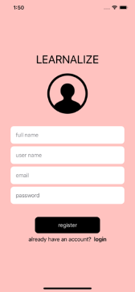
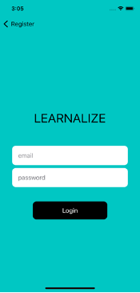
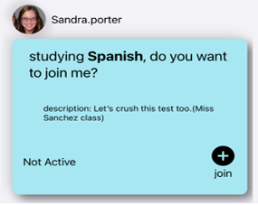
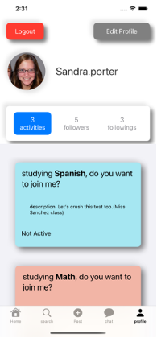
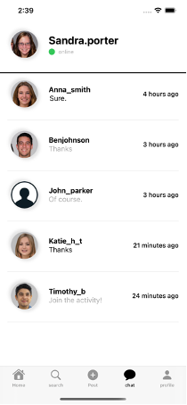
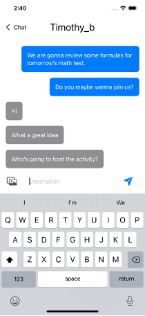
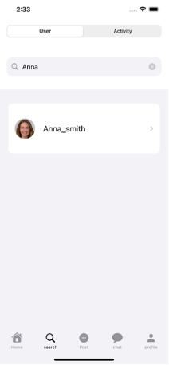
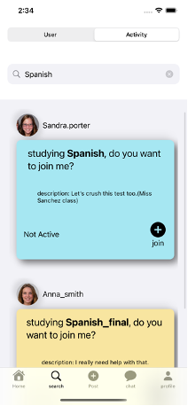
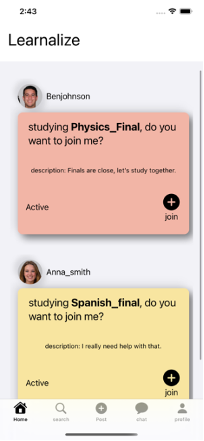
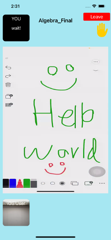

# Learnalize

This is a social Media app designed for iOS users. 
This App enables the students around the world to study together as a group.
The aim of this project is to make learning fun and easy. 

<h3> Here are some of the pages of this app: </h3>

## 1. Authentication pages:

## 2. Activity Cards: 

Instead of Photos and Reels, users share Activity cards in this social media.
They are able to create their own activity cards, which include a topic and a description and a limit on how many users can participate.
Each Activity card represents a certain room with a certain topic. 
Other users can join these rooms and start studying in a group.

  

## 3. Profile page:

Users can view their own activities, followers and followings on their Profile pages.

## 4. Chat:

This is the page where users can send and receive messages.

## 5. Searching users and activities:

On this page users can either search other users or activities.

## 6. Feed:

On this page users can view activities shared by their friends and join if interested. 

## 7. Activity sessions:

Finally, this is where the magic happens. This page is where users use tools such as webcam, microphone and screen sharing to study together.

